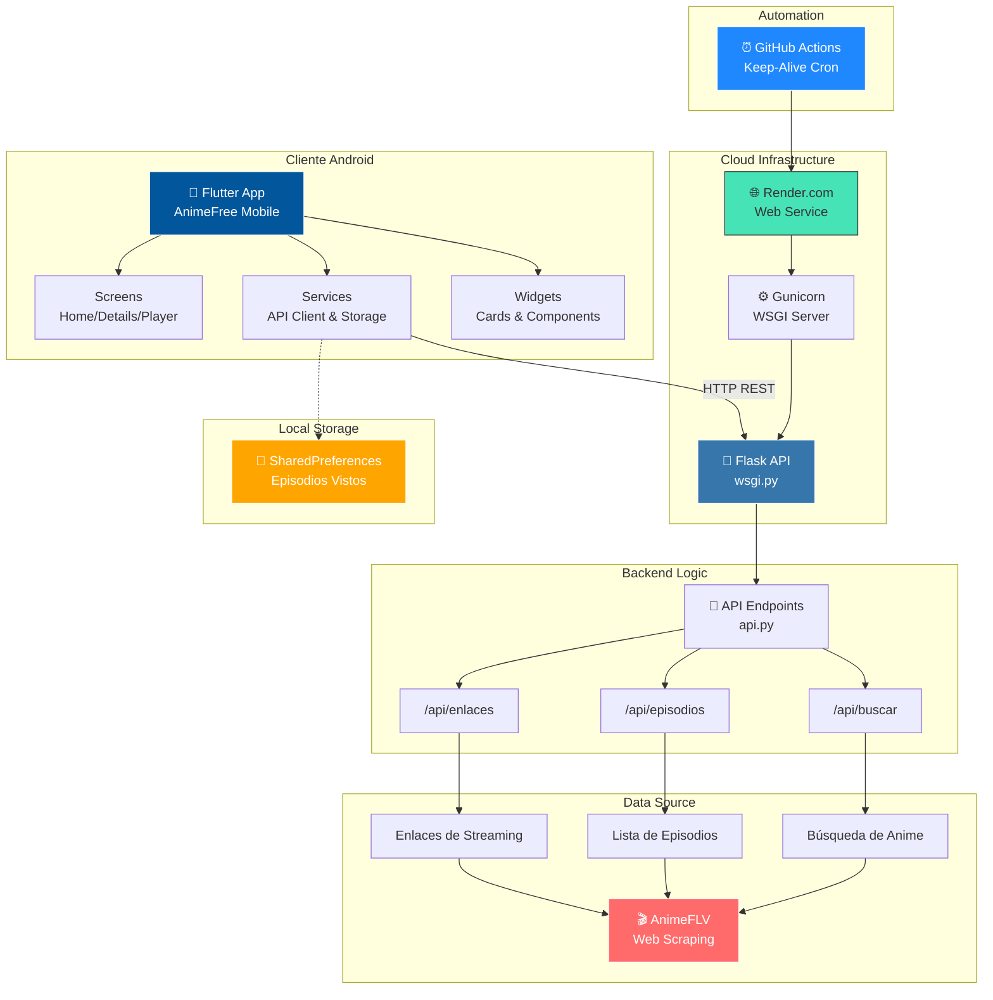

# 🎌 AnimeFree Mobile
> *Tu portal de anime definitivo. Nativo, fluido y sin interrupciones.*

<div align="center">

[](https://flutter.dev)
[](https://python.org)
[](https://www.android.com)
[](LICENSE)


</div>

---

## 🚀 ¿Qué es AnimeFree?

AnimeFree no es solo otro visor; es una **experiencia diseñada para amantes del anime** que valoran la calidad y la velocidad. Olvídate de las webs llenas de publicidad invasiva y reproductores lentos.

Esta aplicación nativa combina la potencia de **Flutter** en el frontend con la versatilidad de **Python** en el backend para ofrecerte streaming directo, gestión de historial y una interfaz oscura inmersiva ("Dark Mode") que cuida tus ojos durante esas maratones nocturnas.

### 🎯 Problema que Resuelve
- ❌ Sitios web lentos con anuncios invasivos
- ❌ Reproductores que se traban constantemente
- ❌ Pérdida del progreso de episodios vistos
- ❌ Interfaces anticuadas y poco intuitivas

### ✅ Solución AnimeFree
- ✨ App nativa Android ultra-rápida
- ✨ Reproductor optimizado con controles gestuales
- ✨ Historial persistente de episodios
- ✨ UI moderna inspirada en plataformas premium

---

## ✨ Características Premium

### 🎨 **Experiencia de Usuario**
- **Zero Ads Experience**: Navegación 100% limpia sin pop-ups molestos
- **Dark Mode Nativo**: Interfaz oscura que reduce la fatiga visual
- **Animaciones Fluidas**: 60fps constantes gracias al motor Skia de Flutter
- **Diseño Material**: Componentes modernos y familiares para usuarios Android

### 🎥 **Reproductor Avanzado**
- **Modo Landscape Forzado**: Inmersión total en pantalla completa
- **Controles Gestuales**: Ajusta brillo y volumen con deslizamientos
- **Multi-Servidor**: Cambio automático si un servidor falla
- **Sin Bloqueos**: Controles inteligentes que no interfieren con el video

### 📊 **Gestión Inteligente**
- **Historial Automático**: Marca episodios vistos con un toque
- **Búsqueda Instantánea**: Encuentra cualquier anime en segundos
- **Persistencia Local**: Tus datos se guardan en el dispositivo (SharedPreferences)
- **Indicadores Visuales**: Checkmarks (✓) para episodios completados

---

## 🧰 Stack Tecnológico

### **Frontend (Mobile)**
- **Framework**: Flutter 3.x
- **Lenguaje**: Dart
- **State Management**: Provider
- **HTTP Client**: http package
- **Storage**: shared_preferences
- **Video Player**: WebView con controles personalizados

### **Backend (API)**
- **Framework**: Flask (Python)
- **Web Scraping**: BeautifulSoup4 / animeflv library
- **Server**: Gunicorn (WSGI)
- **Hosting**: Render.com (Serverless)
- **CORS**: flask-cors

### **DevOps & CI/CD**
- **Version Control**: Git + GitHub
- **Automation**: GitHub Actions (Keep-Alive Cron)
- **Build**: Flutter Build APK
- **Distribution**: GitHub Releases

---

## 🏗️ Arquitectura del Sistema



### 🔄 Flujo de Datos
1. **Usuario busca anime** → App Flutter envía petición HTTP
2. **Backend procesa** → Flask API hace scraping de AnimeFLV
3. **Datos retornan** → JSON con resultados/episodios/enlaces
4. **App renderiza** → UI actualizada con información
5. **Reproducción** → WebView carga stream desde servidor externo
6. **Persistencia** → Estado guardado localmente en el dispositivo

---

## 📲 Descarga e Instalación

### Opción 1: APK Precompilado (Recomendado)
1. Ve a la pestaña **[Releases](../../releases)**
2. Descarga el archivo `app-release.apk` de la última versión
3. Transfiérelo a tu dispositivo Android
4. Habilita "Instalar desde fuentes desconocidas" en Configuración
5. Abre el APK y sigue las instrucciones

### Opción 2: Compilar desde Código
```bash
# Clona el repositorio
git clone https://github.com/DrRobert12/Visor_Anime_V1
cd AnimeFree/mobile

# Instala dependencias
flutter pub get

# Compila el APK
flutter build apk --release

# El APK estará en: build/app/outputs/flutter-apk/app-release.apk
```

---

## 🔮 Roadmap

### v2.0 (Próximamente)
- [ ] 🎯 Soporte para Chromecast
- [ ] ☁️ Sincronización en la nube (Firebase)
- [ ] 🔔 Notificaciones push de nuevos episodios
- [ ] 🌙 Modo offline (descarga de episodios)

### v2.5 (Futuro)
- [ ] 📱 Versión iOS (SwiftUI)
- [ ] 🎨 Temas personalizables
- [ ] 🗣️ Subtítulos multi-idioma
- [ ] 👥 Sistema de recomendaciones

---

## 🤝 Contribuciones

¡Las contribuciones son bienvenidas! Si tienes ideas para mejorar AnimeFree:

---

## 📄 Licencia

Este proyecto está bajo la Licencia MIT. Consulta el archivo [LICENSE](LICENSE) para más detalles.

---

## 👨‍💻 Sobre el Desarrollador

**RobertDev**

[](https://github.com/DrRobert12)


---

<div align="center">

**Hecho con ojeras y mucho código**

*Disclaimer: Este proyecto es un ejercicio educativo de desarrollo mobile y web scraping.*  
*El contenido mostrado es propiedad de sus respectivos dueños.*

</div>

