# 🎌 AnimeFree Mobile
> *Tu portal de anime definitivo. Nativo, fluido y sin interrupciones.*

 

  
  
  

 

## 🚀 ¿Qué es AnimeFree?
AnimeFree no es solo otro visor; es una experiencia diseñada para **amantes del anime** que valoran la calidad y la velocidad. Olvídate de las webs llenas de publicidad invasiva y reproductores lentos.

Esta aplicación nativa combina la potencia de **Flutter** en el frontend con la versatilidad de **Python** en el backend para ofrecerte streaming directo, gestión de historial y una interfaz oscura inmersiva ("Dark Mode") que cuida tus ojos durante esas maratones nocturnas.

## ✨ Características Premium
*   **Zero Ads Experience**: Navegación 100% limpia sin pop-ups molestos.
*   **Rendimiento Nativo**: Animaciones fluidas a 60fps gracias al motor Skia de Flutter.
*   **Player Inmersivo**: Reproductor optimizado para Landscape, con controles por gestos (brillo/volumen) y soporte para múltiples servidores de video.
*   **Sincronización Inteligente**: 
    *   Historial automático de episodios vistos.
    *   Buscador global ultra-rápido.
    *   Indicadores visuales de progreso.

## 🛠️ Arquitectura Técnica
Este proyecto demuestra una arquitectura moderna cliente-servidor, desacoplada y escalable.

```mermaid
graph LR
    A[📱 Flutter Mobile App] -->|REST API| B(☁️ Python Backend)
    B -->|Scraping| C{🌍 Anime Sources}
    C -->|Stream Links| B
    B -->|JSON Data| A
```

*   **Frontend**: Dart + Flutter (Provider State Management).
*   **Backend**: Flask API hosteada en Render (Serverless architecture).
*   **CI/CD**: Integración continua con GitHub Actions para health-checks del servidor.

## 📲 Descarga e Instalación
¡Prueba la última versión ahora mismo!

1.  Ve a la pestaña de [Releases](../../releases).
2.  Descarga el archivo `app-release.apk`.
3.  Instálalo en tu dispositivo Android.

## 🔮 Roadmap
- [ ] Soporte para Chromecast
- [ ] Listas de "Favoritos" en la nube
- [ ] Notificaciones de nuevos episodios

## 👨‍💻 Sobre el Desarrollador
Creado con pasión por **RobertDev**. 
Si te gusta este proyecto, ¡no olvides dejar una ⭐️ estrella en el repo!

---
*Disclaimer: Este proyecto es un ejercicio educativo de desarrollo mobile y web scraping. El contenido mostrado es propiedad de sus respectivos dueños.*
